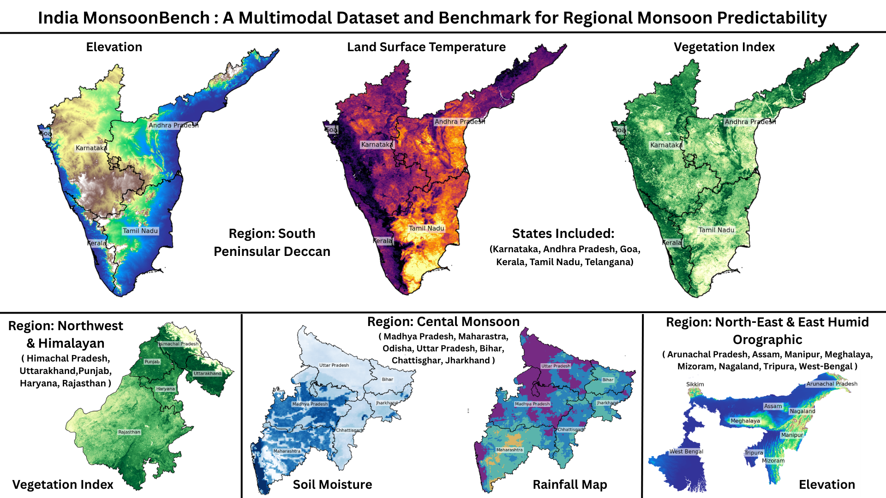

# India MonsoonBench

<p align="center">
  
</p>

**India MonsoonBench** is a spatially aligned multimodal dataset and benchmark for studying regional Indian rainfall anomaly predictability. It is framed as a dataset/resource contribution: the goal is not to introduce a new global weather foundation model, but to provide a reproducible regional benchmark where researchers can study how recent land-atmosphere observations relate to next-month rainfall anomaly classes across distinct Indian hydroclimatic regimes.

The benchmark combines Earth-observation predictors, Indian Meteorological Department long-period-average rainfall normals, region-aware patch extraction, year-held-out temporal splits, temporal neural baselines, climate-naive baselines, ordinal metrics, extreme-regime diagnostics, monsoon-transition evaluation, and modality-ablation analysis.

## Scientific Motivation

Indian monsoon rainfall is spatially heterogeneous: Himalayan foothills, the central monsoon core, the peninsular Deccan, and humid orographic northeast India follow different land-atmosphere dynamics. A single India-wide accuracy score can hide this regime structure. India MonsoonBench therefore asks a regime-aware scientific question:

> How predictable are monthly Indian rainfall anomaly classes from recent multimodal land-atmosphere observations, and how does predictability vary across hydroclimatic regimes, seasons, modalities, and extremes?

This makes the benchmark useful for climate-AI researchers who need a structured dataset for regional predictability analysis, temporal modeling, ordinal rainfall classification, and diagnostic evaluation under monsoon transitions.

## Dataset Story

The dataset starts from state-wise Earth-observation rasters and converts them into spatially aligned monthly predictor stacks. Rainfall labels are defined using a physically interpretable anomaly ratio: observed CHIRPS rainfall is compared against Indian Meteorological Department (IMD) long-period-average rainfall normals. This creates five ordered rainfall anomaly classes following the familiar IMD interpretation of Scarcity, Deficit, Normal, Excess, and Large Excess rainfall.

Unlike a generic image-classification dataset, India MonsoonBench preserves the spatial organization of each state and groups states into hydroclimatic rainfall regimes. The processed benchmark currently covers 25 Indian states across four regions. Large raster stacks and patch arrays are distributed separately from the GitHub repository; this repo contains the code, metadata, documentation, lightweight result summaries, and reproducibility scripts.

## Benchmark Formulation

The core task is **monthly autoregressive rainfall anomaly forecasting**. For each spatial patch `s` and target month `t`, the model receives the previous three months of multimodal predictors and predicts the rainfall anomaly class for the next month.

| Component | Design |
|---|---|
| Task | Monthly autoregressive rainfall anomaly forecasting |
| Input | Three previous months of multimodal predictors |
| Target | Next-month rainfall anomaly class |
| Formalization | Given `X(s,t-2)`, `X(s,t-1)`, and `X(s,t)`, predict `Y(s,t+1)` |
| Example windows | Jan-Feb-Mar -> Apr; Feb-Mar-Apr -> May; Oct-Nov-Dec -> Jan of the next year |
| Spatial unit | State-level raster patch `s` |
| Patch size | 15 x 15 pixels |
| Dynamic predictors | Precipitation history, LST, NDVI, relative humidity, soil moisture, wind speed |
| Static predictor | Elevation |
| Input channels | 6 dynamic predictors x 3 months + 1 static elevation = 19 channels |
| Input years | 2020-2024 |
| Target-year split | Train: 2021-2022; validation: 2023; test: 2024 |
| Target months | January-December |

The year-held-out split avoids evaluating on random patches from the same target month. For example, target April 2024 uses January, February, and March 2024 predictors, while target January 2024 uses October, November, and December 2023 predictors. The year 2024 is held out for final testing.

## Rainfall Class Labels

Ground-truth classes are derived from the rainfall anomaly ratio:

`ratio = observed monthly rainfall / IMD long-period-average rainfall`

| Class ID | Class name | Ratio rule | Interpretation |
|---:|---|---|---|
| 0 | Scarcity | `ratio < 0.4` | Severe rainfall shortage |
| 1 | Deficit | `0.4 <= ratio < 0.8` | Below-normal rainfall |
| 2 | Normal | `0.8 <= ratio < 1.2` | Near-normal rainfall |
| 3 | Excess | `1.2 <= ratio < 1.6` | Above-normal rainfall |
| 4 | Large Excess | `ratio >= 1.6` | Strong rainfall surplus |

These labels are ordinal. Predicting Scarcity as Deficit is not physically equivalent to predicting Scarcity as Large Excess. For this reason, the benchmark reports both standard classification metrics and ordinal-distance diagnostics.

## Regional Coverage

| Region | States in processed benchmark | Samples | Channels |
|---|---|---:|---:|
| Northwest-Himalayan | Himachal Pradesh, Rajasthan, Haryana, Punjab, Uttarakhand | 115,917 | 19 |
| Central Indian Monsoon Core | Bihar, Chhattisgarh, Jharkhand, Madhya Pradesh, Maharashtra, Uttar Pradesh | 238,057 | 19 |
| South Peninsular-Deccan | Karnataka, Kerala, Andhra Pradesh, Goa, Tamil Nadu | 100,737 | 19 |
| East-Northeast Humid Orographic | Assam, Arunachal Pradesh, Manipur, Meghalaya, Mizoram, Nagaland, Sikkim, Tripura, West Bengal | 57,440 | 19 |

The current processed release covers 25 states. Jammu and Kashmir, Odisha, and Telangana are documented as missing from the processed benchmark because complete GEE exports/post-processing were not available at the rebuttal deadline.

## Dataset Size

The GitHub repository stores code, documentation, website assets, and lightweight CSV summaries. Large arrays and raster products are distributed through the external data archive.

| Artifact | Contents | Approx. size |
|---|---|---:|
| Compressed data archive | Packaged release uploaded externally | 918.5 MB |
| Expanded data archive | Patch datasets, metadata, and result summaries | About 8.3 GB |
| Northwest-Himalayan patch dataset | `X.npy`, `y.npy`, sample metadata, train/val/test indices | 1.9 GB |
| Central Indian Monsoon Core patch dataset | `X.npy`, `y.npy`, sample metadata, train/val/test indices | 3.9 GB |
| South Peninsular-Deccan patch dataset | `X.npy`, `y.npy`, sample metadata, train/val/test indices | 1.7 GB |
| East-Northeast Humid Orographic patch dataset | `X.npy`, `y.npy`, sample metadata, train/val/test indices | 949 MB |
| GitHub `results/` summaries | Metadata, compact benchmark summaries, transition analysis | 84 KB |
| GitHub `website/` assets | Static project page and figures | 32 MB |

## Temporal Splits

| Region | Train target years 2021-2022 | Validation target year 2023 | Test target year 2024 | Total samples |
|---|---:|---:|---:|---:|
| Northwest-Himalayan | 57,957 | 28,980 | 28,980 | 115,917 |
| Central Indian Monsoon Core | 119,037 | 59,516 | 59,504 | 238,057 |
| South Peninsular-Deccan | 50,367 | 25,185 | 25,185 | 100,737 |
| East-Northeast Humid Orographic | 28,713 | 14,367 | 14,360 | 57,440 |

## Methodology

The end-to-end pipeline has five stages:

1. Export state-wise Earth-observation bands from Google Earth Engine.
2. Align monthly predictors and rainfall targets onto a common state raster grid.
3. Convert rainfall into IMD LPA anomaly classes.
4. Extract monthly autoregressive patch samples with a 3-month input window and 1-month target horizon.
5. Train and evaluate region-specific temporal baselines under held-out-year testing.

The benchmark is intentionally trained **per region**. This avoids forcing one model to average over very different hydroclimatic regimes and makes region-level failure modes visible.

## Models and Baselines

The benchmark includes temporal deep-learning baselines and climate-naive baselines:

| Baseline family | Models |
|---|---|
| Temporal neural baselines | Conv3D, ConvLSTM, Swin3D |
| Loss variants | Cross entropy, focal loss, ordinal-aware variants |
| Climate-naive baselines | Persistence, seasonal climatology |
| Diagnostics | Ordinal metrics, extreme-regime recall, transition-specific evaluation, modality ablation |

Persistence predicts the next rainfall class from recent observed rainfall class context. Seasonal climatology predicts using month-specific historical class frequencies. These simple baselines are important because rainfall anomaly forecasting can be dominated by seasonal structure in some regions.

## Benchmark Results

| Region | Best neural accuracy | Best neural weighted F1 | Best simple accuracy | Best simple weighted F1 | Main result |
|---|---:|---:|---:|---:|---|
| Northwest-Himalayan | 0.396, Swin3D | 0.379, ConvLSTM | 0.372, seasonal climatology | 0.352, persistence | Neural models improve over simple baselines |
| Central Indian Monsoon Core | 0.357, ConvLSTM | 0.348, Swin3D | 0.394, seasonal climatology | 0.377, seasonal climatology | Seasonal climatology is strongest |
| South Peninsular-Deccan | 0.429, ConvLSTM | 0.437, ConvLSTM | 0.422, seasonal climatology | 0.398, seasonal climatology | ConvLSTM gives strongest weighted F1 gain |
| East-Northeast Humid Orographic | 0.286, ConvLSTM | 0.283, ConvLSTM | 0.354, seasonal climatology | 0.331, seasonal climatology | Hardest regime; simple climatology remains strong |

The results show that temporal neural models are helpful in some regimes, especially South Peninsular-Deccan and Northwest-Himalayan, but they do not uniformly beat seasonal climatology. This is scientifically important: it shows that monthly anomaly forecasting is not solved simply by adding deep models, and that any serious benchmark must include climate-naive baselines.

## Ordinal and Extreme-Regime Evaluation

Because the rainfall classes are ordered, the benchmark reports ordinal-aware metrics:

| Metric | Meaning |
|---|---|
| Accuracy | Exact rainfall-class match |
| Weighted F1 | Class-imbalance-aware F1 score |
| Within-1 accuracy | Prediction is correct or within one adjacent class |
| Mean absolute class error | Average ordinal distance between predicted and true classes |
| Severe error rate | Fraction of predictions more than one class away |
| Scarcity recall | Recall for the driest extreme class |
| Large Excess recall | Recall for the wettest extreme class |

Key diagnostic result: models often achieve much higher within-one-class accuracy than exact accuracy. This means many errors are adjacent-class mistakes rather than physically catastrophic errors. However, Large Excess recall remains difficult in some regions, especially the East-Northeast Humid Orographic regime, showing that wet extremes remain a challenging target.

## Monsoon-Transition Evaluation

The benchmark evaluates performance across monsoon-relevant periods rather than only reporting annual aggregate scores.

| Transition label | Target months | Scientific interpretation |
|---|---|---|
| Winter to pre-monsoon | February-April | Dry-season and heating buildup context |
| Pre-monsoon to monsoon onset | May-June | Transition into the monsoon circulation |
| Monsoon onset to peak | July-August | Active monsoon intensification |
| Monsoon peak to retreat | September | Late monsoon and withdrawal phase |
| Monsoon retreat to post-monsoon | October-November | Rainfall regime decay and post-monsoon anomalies |
| Post-monsoon winter context | December-January | Cross-year context and winter transition |

The transition analysis shows that predictability varies strongly by season. Monsoon onset-to-peak and peak-to-retreat periods can be easier in several regions, while post-monsoon and winter-context periods are often harder. This supports the dataset framing: the resource enables researchers to study when regional monsoon anomaly classes are predictable, not only whether one model has the highest aggregate score.

## Scientific Insights

India MonsoonBench currently supports five main scientific observations:

1. **Regional heterogeneity matters.** The four hydroclimatic regimes show different levels of predictability and different model rankings. A single all-India benchmark score would hide these differences.
2. **Temporal modeling helps, but not everywhere.** ConvLSTM and Swin3D improve performance in Northwest-Himalayan and South Peninsular-Deccan regimes, but seasonal climatology remains highly competitive in Central Monsoon Core and East-Northeast Humid Orographic regions.
3. **Simple climate baselines are essential.** Seasonal climatology beating neural models in some regimes is not a failure of the dataset; it is a useful scientific finding about the strength of seasonal structure and the difficulty of monthly anomaly forecasting.
4. **Ordinal evaluation changes the interpretation.** Exact accuracy alone underestimates useful performance because many errors are adjacent rainfall classes. Severe-error metrics better capture physically meaningful failures.
5. **Extremes remain difficult.** Scarcity recall is often stronger than Large Excess recall, and wet extremes in orographic regions are especially challenging, suggesting a need for better representation of localized moisture transport and topographic rainfall processes.

## What This Dataset Is and Is Not

India MonsoonBench is:

| It is | It is not |
|---|---|
| A regional, spatially aligned multimodal rainfall anomaly benchmark | A global weather foundation-model training corpus |
| A held-out-year evaluation resource for 2020-2024 Earth-observation data | A long-term climate trend attribution dataset |
| A benchmark for temporal models, simple climate baselines, ordinal metrics, and diagnostics | A replacement for operational numerical weather prediction systems |
| A reproducible code and metadata release with external large-data archives | A claim that deep models uniformly outperform climatology |

## Repository Contents

| Path | Purpose |
|---|---|
| `scripts/export_state_data.py`, `scripts/export_missing_months_state_data.py` | Google Earth Engine export scripts |
| `scripts/process_state_data.py` | Rainfall class generation and raster masking |
| `scripts/extract_monthly_autoregressive_patches.py` | Monthly AR patch extraction |
| `scripts/make_splits.py` | Year-held-out split generation |
| `scripts/train_patch_baselines.py` | CNN, Conv3D, ConvLSTM, Swin3D and loss variants |
| `scripts/run_region_rebuttal_followups.py` | Regional model training/evaluation workflow |
| `scripts/run_monthly_ar_simple_baselines.py` | Persistence and seasonal climatology baselines |
| `scripts/compute_ordinal_metrics.py` | Ordinal-distance metrics |
| `scripts/analyze_extreme_regime_errors.py` | Scarcity/Large Excess error analysis |
| `scripts/analyze_transition_specific_performance.py` | Monsoon-transition evaluation |
| `results/` | Lightweight CSV result summaries suitable for git |
| `website/` | Static project page with figures, tables, and benchmark explanation |
| `docs/` | Repository organization and dataset usage notes |
| `notebooks/` | Lightweight tutorial notebook for inspecting the archive |

Large rasters, NumPy patch datasets, model checkpoints, and logs are intentionally excluded from git. They should be generated locally or distributed through the separate data archive.

## Quick Start

Create an environment:

```bash
conda create -n monsoonbench python=3.10 -y
conda activate monsoonbench
pip install -r requirements.txt
```

Extract one regional monthly AR dataset:

```bash
python scripts/extract_monthly_autoregressive_patches.py \
  --manifest modeling_manifest.csv \
  --region northwest_himalayan \
  --output-dir patch_dataset_monthly_ar_northwest_himalayan_full \
  --dynamic-modalities precipitation,lst,ndvi,rh,soil_moisture,wind_speed \
  --static-predictor elevation \
  --target-years 2021,2022,2023,2024 \
  --target-months 1,2,3,4,5,6,7,8,9,10,11,12 \
  --input-window 3 \
  --horizon 1 \
  --patch-size 15 \
  --stride 16 \
  --min-valid-fraction 0.5 \
  --fill-value 0.0 \
  --skip-incomplete-states
```

Train a temporal baseline:

```bash
python scripts/train_patch_baselines.py \
  --dataset-dir patch_dataset_monthly_ar_northwest_himalayan_full \
  --output-dir baseline_runs/convlstm_monthly_ar_northwest_himalayan_ce \
  --model convlstm \
  --loss ce \
  --epochs 30 \
  --batch-size 16 \
  --disable-early-stopping
```

Compute diagnostics:

```bash
python scripts/analyze_patch_predictions.py \
  --dataset-dir patch_dataset_monthly_ar_northwest_himalayan_full \
  --run-dir baseline_runs/convlstm_monthly_ar_northwest_himalayan_ce

python scripts/compute_ordinal_metrics.py \
  --run-dirs baseline_runs/convlstm_monthly_ar_northwest_himalayan_ce \
  --output-csv baseline_runs/convlstm_monthly_ar_northwest_himalayan_ce/ordinal_metrics_summary.csv \
  --write-json
```

## Project Website

The static project website is in `website/`. To preview locally:

```bash
python -m http.server 8080 --directory website
```

Then open `http://localhost:8080`.

## Data Availability

The repository does not include large raster exports, patch arrays, model checkpoints, or full training logs. The code documents the full processing pipeline from GEE export to model evaluation, while `results/` contains lightweight summaries that are safe to version-control.

The compressed dataset archive is available here:

[India MonsoonBench data archive](https://drive.google.com/drive/folders/1w8cE4vUk6ThXHbsKpT9GTpr8nvkQJbF0?usp=drive_link)

A checksum is recommended for the released archive so users can verify that their downloaded file exactly matches the intended dataset package. For long-term public release, this archive can also be mirrored to a persistent repository such as Zenodo.

## How to Use the Dataset Archive

After downloading and extracting the archive, the expected layout is:

```text
India_MonsoonBench_DataRelease/
  README_DATA.md
  MANIFEST.csv
  metadata/
  results/
  patch_datasets/
    patch_dataset_monthly_ar_northwest_himalayan_full/
    patch_dataset_monthly_ar_central_monsoon_core_full_bihar/
    patch_dataset_monthly_ar_south_peninsular_deccan_full/
    patch_dataset_monthly_ar_east_northeast_humid_orographic_full_assam/
```

Each regional patch dataset contains:

| File | Purpose |
|---|---|
| `X.npy` | Input tensor with 19 channels per patch |
| `y.npy` | Rainfall anomaly class labels |
| `samples.csv` | Patch metadata including state, target year, and target month |
| `train_idx.npy` | Training indices for target years 2021-2022 |
| `val_idx.npy` | Validation indices for target year 2023 |
| `test_idx.npy` | Test indices for target year 2024 |
| `config.json` | Patch extraction configuration |
| `split_summary.csv` | Split-level sample counts |

For a lightweight walkthrough, open:

```text
notebooks/india_monsoonbench_quickstart.ipynb
```

## Citation

If you use India MonsoonBench, please cite this repository and the accompanying paper/resource release. A `CITATION.cff` file is included for GitHub citation metadata.
